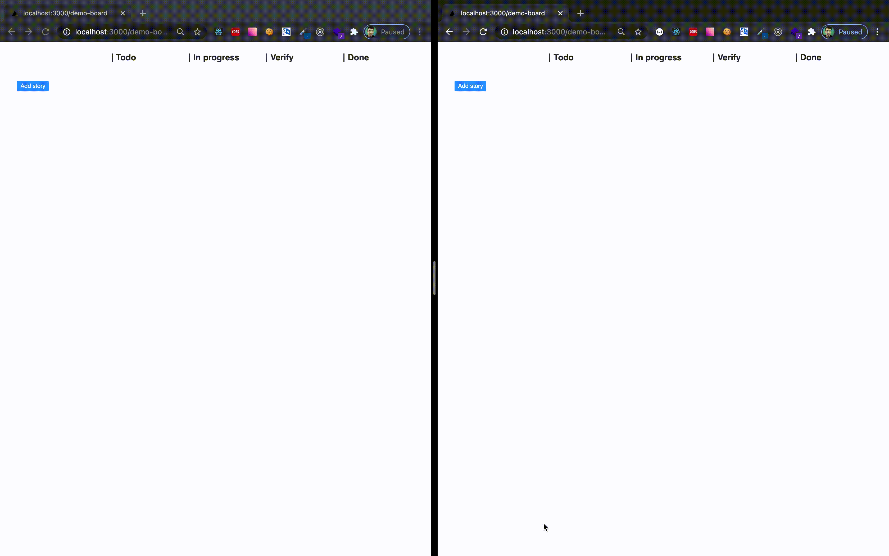

# Scrumboard

The simplest task tracking tool for dev teams.



## Technologies used

- [Next.js](https://nextjs.org)
- [Socket.io](https://socket.io)
- [React DnD](https://react-dnd.github.io/react-dnd/about)
- [MobX](https://mobx.js.org/README.html)
- [Sequelize](https://sequelize.org)

## Development

Start local DB:

```bash
docker run --rm --name postgres -e POSTGRES_PASSWORD=scrumboard -e POSTGRES_USER=scrumboard -p 5432:5432 -d postgres
```
Install dependencies:

```bash
yarn install
```

Start development server:

```bash
yarn run dev
```

Now the app should be available on [localhost:3000](http://localhost:3000). To create
the database schema call [localhost:3000/api](http://localhost:3000/api) once.

Build the project:

```bash
yarn build
```

Run build on a server:

```bash
yarn start
```

### Dev tools used:

- [Typescript](https://www.typescriptlang.org/)
- Linting with [ESLint](https://eslint.org/)
- Formatting with [Prettier](https://prettier.io/)
- Linting, typechecking and formatting on by default using [`husky`](https://github.com/typicode/husky) for commit hooks
- Testing with [Jest](https://jestjs.io/) and [`react-testing-library`](https://testing-library.com/docs/react-testing-library/intro)

## Contributing

Thanks for your interest in Scrumboard! You are very welcome to contribute. Just follow
the [debelopment guide](#development) and open a PR. Also, reporting and upvoting issues
is highly appreciated.

## Features/Todo

- [x] Markdown support
- [ ] Manage user colors
- [ ] Delete a board
- [ ] Keyboard shortcuts
